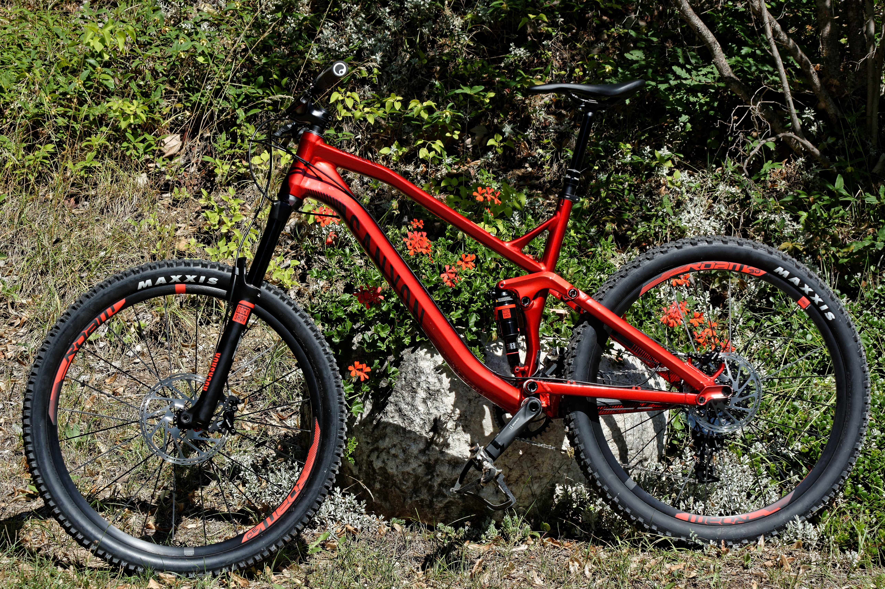

Ici je note tous les bons plans de type "outdoor":

* traces gps de vtt, vélo de route, rando
* bonnes addresses de vacances

## Traces GPS

### Aout 2016, Guillestre

09/08/16 - #vtt - [VisuGPX](http://www.visugpx.com/?i=9MtIraFDEZ) : vélo Guil, Simoust, plateau de Guillestre, Durance, St-Crépin.
Nico, Laurent, (Catherine), Gérard. [GPX](../assets/160809-Simoust-St-Crepin.gpx). Dénivelé 293m.

09/08/16 - #vtt - [VisuGPX](http://www.visugpx.com/?i=9MtIraFDEZ) : vélo Guil, Simoust, plateau de Guillestre, Durance, St-Crépin.
Nico, Laurent, (Catherine), Gérard. [GPX](../assets/160809-Simoust-St-Crepin.gpx). Dénivelé 293m.

## Bon plans vacances

### Septembre 201O, Mojacar

Super vacances au Sud de l'Espagne, région de Capo De Gata.
Voir la page [dédiée](/trips/mojacar).

### August 2016, Serre Ponçon

## Liens divers

mettre un lien vers Garmin Connect
